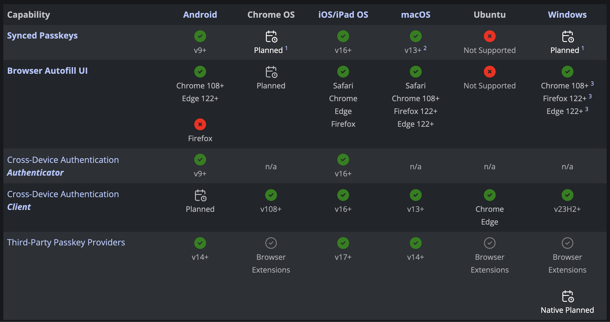
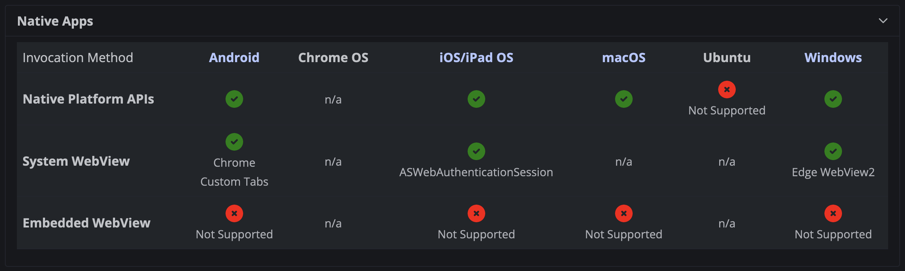
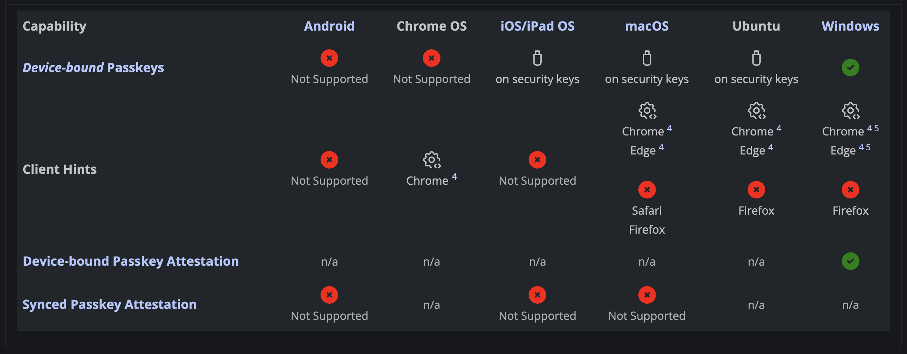

% FIDO and WebAuth and CTAP Oh My!
% Robert Ward <robert@rtward.com> & Joe Cathell <kamikazejoe@gmail.com>
%<br/>Talk: [${TALK_URL}](${TALK_URL})<br/>Repo: [${REPO_URL}](${REPO_URL})

# FIDO and WebAuth and CTAP Oh My!

## What the hell does that all mean?

> - Passkeys are WebAuthn
> - WebAuthn is U2F
> - U2F is FIDO2
> - CTAP is how your authenticator talks to your browser

::: notes

It's really very simple...

:::

## Okay but what _are_ they?

> - Public Key Authentication System
> - Similar to SSH keys
> - You use a private key to prove ownership over a public key.
> - The website has _no_ secrets to keep

::: notes

If you've ever used SSH keys, FIDO is the same concept but applied to browsers. And all these other technologies are built on top of FIDO

:::

# Technical Details

## Terminology

> - Client: The user's browser or an app. The thing the user is interacting with directly.
> - Authenticator: The device performing the cryptographic operation
> - Relying Party: The website that the user is authenticating themselves to

## FIDO2 - Authentication

> - User's browser asks for an `Authentication Assertion`
>   - Includes as much info as possible
>   - May include a user ID
>   - May include credential type
>   - May not include anything!

## FIDO2 - Authentication

> - The site generates a `challange` which is 29 random bytes and sends it to the browser
>   - The challange payload may also include allowed creds or other info useful to the browser

## FIDO2 - Authentication

```json
{
  "publicKey": {
    "timeout": 60000,
    "challenge": "aaaaaaaaaaaaaaaaaaaaaaaaaaaaaaaaaaaaaaaaaaa",
    "allowCredentials": [
      {
        "type": "public-key",
        "id": "pub-key-id-1"
      },
      {
        "type": "public-key",
        "id": "pub-key-id-2"
      }
    ],
    "rpId": "github.com"
  }
}
```

::: notes

The timeout, challenge, and rpId are the important parts of this.

`allowCredentials` may not be included if the login is key only

:::

## FIDO2 - Authentication

> - The browser passes the `challange` along with the origin to the authenticator
>   - The authenticator could be a hardware token, the browser itself, or another device like a phone
>   - Because the challange includes the origin, phishing sites can't get FIDO creds

## FIDO2 - Authentication

```json
{
  "challenge": "aaaaaaaaaaaaaaaaaaaaaaaaaaaaaaaaaaaaaaaaaaa",
  "origin": "https://github.com",
  "type": "webauthn.get"
}
```

::: notes

This is what is actually sent to the authenticator.

It will sign the challange with the corresponding public key and return the signature

Since the payload includes the origin, you can't MITM the challenge

:::

## FIDO2 - Authentication

```json
{
  "type": "public-key",
  "id": "pub-key-id-1",
  "rawId": "pub-key-id-1",
  "authenticatorAttachment": "cross-platform",
  "response": {
    "clientDataJSON": "eyJjaGFsbGVuZ2UiOiJhYWFhYWFhYWFhYWFhYWFhYWFhYWFhYWFhYWFhYWFhYWFhYWFhYWFhYWFhIiwib3JpZ2luIjoiaHR0cHM6Ly9naXRodWIuY29tIiwidHlwZSI6IndlYmF1dGhuLmdldCJ9",
    "authenticatorData": "...",
    "signature": "...",
    "userHandle": null
  }
}
```

::: notes

This is the payload returned to the site. The clientDataJSON and the signature are the important parts

:::

## FIDO2 - Authentication

> - The site will then validate the signature and provide the user with credentials if it's valid
> - And that's it!

## FIDO2 - Enrollment

> - Similar to the authentication workflow
> - The client signs a challenge to prove ownership of a key

## FIDO2 - Enrollment

```javascript
{
  // The challenge is produced by the server; see the Security Considerations
  challenge: new Uint8Array([21,31,105 /* 29 more random bytes generated by the server */]),

  // Relying Party:
  rp: {
    name: "ACME Corporation"
  },

  // User:
  user: {
    id: Uint8Array.from(window.atob("MIIBkzCCATigAwIBAjCCAZMwggE4oAMCAQIwggGTMII="), c=>c.charCodeAt(0)),
    name: "alex.mueller@example.com",
    displayName: "Alex Müller",
  },

  // This Relying Party will accept either an ES256 or RS256 credential, but
  // prefers an ES256 credential.
  pubKeyCredParams: [
    {
      type: "public-key",
      alg: -7 // "ES256" as registered in the IANA COSE Algorithms registry
    },
    {
      type: "public-key",
      alg: -257 // Value registered by this specification for "RS256"
    }
  ],

  authenticatorSelection: {
    // Try to use UV if possible. This is also the default.
    userVerification: "preferred"
  },

  timeout: 360000,  // 6 minutes
  excludeCredentials: [
    // Don’t re-register any authenticator that has one of these credentials
    {"id": Uint8Array.from(window.atob("ufJWp8YGlibm1Kd9XQBWN1WAw2jy5In2Xhon9HAqcXE="), c=>c.charCodeAt(0)), "type": "public-key"},
    {"id": Uint8Array.from(window.atob("E/e1dhZc++mIsz4f9hb6NifAzJpF1V4mEtRlIPBiWdY="), c=>c.charCodeAt(0)), "type": "public-key"}
  ],

  // Make excludeCredentials check backwards compatible with credentials registered with U2F
  extensions: {"appidExclude": "https://acme.example.com"}
}
```

## FIDO2 - Enrollment

> - The client sends the signed payload to the relying party for registration

## Passkeys

> - Basically a brand name of WebAuthn3
> - Allow for syncing of private keys across devices
> - Allow for Bluetooth authentication e.g. phone to laptop
> - Allow for dual signatures, shared and device

::: notes

Dual signatures is not well supported yet, but functionality is planned for most systems

:::

# Support

## Browsers

> - https://passkeys.dev/device-support/
> - Windows & Mac are fully supported on all browsers
> - Linux has basic FIDO support
> - iOS and Android have full support

## Browsers



## Browsers



## Browsers



# Resources

- [FIDO Specs Archive](https://fidoalliance.org/specifications/download/)
- [WebAuthn](https://www.w3.org/TR/webauthn/#sctn-usecase-new-device-registration)
- [Passkeys White Paper](https://fidoalliance.org/wp-content/uploads/2022/03/How-FIDO-Addresses-a-Full-Range-of-Use-Cases-March24.pdf)

---

Robert Ward <robert@rtward.com>

Joe Cathell <kamikazejoe@gmail.com>


Talk: [${TALK_URL}](${TALK_URL})

Repo: [${REPO_URL}](${REPO_URL})
